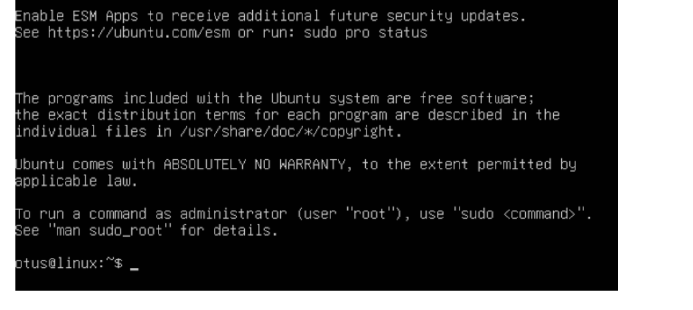

# homework-pxe

Описание домашнего задания
---
1. Настроить загрузку по сети дистрибутива Ubuntu 24
2. Установка должна проходить из HTTP-репозитория.
3. Настроить автоматическую установку c помощью файла user-data


---
ОС для настройки: ubuntu 22_04 (7 виртуальных машин)

Vagrant версии 2.4.1

VirtualBox версии 7.0.18

---
- Этап 1: Разворот хостов и настройка загрузки по сети

**Запускаем установку ВМ из Vagrantfile**

файл доступен в репозитории

---
- Этап 2: Настройка DHCP и TFTP-сервера


**Отключаем firewall**

```bash
systemctl stop ufw
systemctl disable ufw
```

**Обновляем кэш и устанавливаем утилиту dnsmasq**

```bash
sudo apt update
sudo apt install dnsmasq
```


**Создаём файл /etc/dnsmasq.d/pxe.conf и добавляем в него следующее содержимое**

```bash
#Указываем интерфейс в на котором будет работать DHCP/TFTP
interface=eth1
bind-interfaces
#Также указаваем интерфейс и range адресов которые будут выдаваться по DHCP
dhcp-range=enp0s8,10.0.0.100,10.0.0.120
#Имя файла, с которого надо начинать загрузку для Legacy boot (этот пример рассматривается в методичке)
dhcp-boot=pxelinux.0
#Имена файлов, для UEFI-загрузки (не обязательно добавлять)
dhcp-match=set:efi-x86_64,option:client-arch,7
dhcp-boot=tag:efi-x86_64,bootx64.efi
#Включаем TFTP-сервер
enable-tftp
#Указываем каталог для TFTP-сервера
tftp-root=/srv/tftp/amd64
```


**Cоздаём каталоги для файлов TFTP-сервера**

```bash
mkdir -p /srv/tftp
```

**Cкачиваем файлы для сетевой установки Ubuntu 24.04 и распаковываем их в каталог /srv/tftp**
Ссылку из методички меняем, предложенная недоступна

```bash
wget https://releases.ubuntu.com/noble/ubuntu-24.04.1-netboot-amd64.tar.gz
tar -xzvf ubuntu-24.04.1-netboot-amd64.tar.gz -C /srv/tftp
```


**Перезапускаем службу dnsmasq**
```bash
systemctl restart dnsmasq
```


---
- Этап 3: Настройка Web-сервера


**Устанавливаем Web-сервер apache2**
```bash
sudo apt install apache
```


**Cоздаём каталог /srv/images в котором будут храниться iso-образы для установки по сети**
```bash
mkdir /srv/images
```


**Переходим в каталог /srv/images и скачиваем iso-образ ubuntu 24.04**
```bash
cd /srv/images
wget https://releases.ubuntu.com/noble/ubuntu-24.04.1-live-server-amd64.iso
```


**Создаём файл /etc/apache2/sites-available/ks-server.conf и добавлем в него следующее содержимое**
```bash
#Указываем IP-адрес хоста и порт на котором будет работать Web-сервер
<VirtualHost 10.0.0.20:80>
DocumentRoot /
# Указываем директорию /srv/images из которой будет загружаться iso-образ
<Directory /srv/images>
Options Indexes MultiViews
AllowOverride All
Require all granted
</Directory>
</VirtualHost>
```


**Активируем конфигурацию ks-server в apache**
```bash
sudo a2ensite ks-server.conf
```


**Вносим изменения в файл /srv/tftp/amd64/pxelinux.cfg/default**
```bash
nano /srv/tftp/amd64/pxelinux.cfg/default
#
DEFAULT install
LABEL install
KERNEL linux
INITRD initrd
APPEND root=/dev/ram0 ramdisk_size=3000000 ip=dhcp iso-url=http://10.0.0.20/srv/images/ubuntu-24.04.1-live-server-amd64.iso autoinstall
```


**Перезагружаем web-сервер apache**
```bash
systemctl restart apache2
```
Проверяем, что загрузка по сети работает


---
- Этап 4: Настройка автоматической установки Ubuntu 24.04


**Создаём каталог для файлов с автоматической установкой**
```bash
mkdir /srv/ks
```


**Создаём файл /srv/ks/user-data и добавляем в него следующее содержимоеvim /srv/ks/user-data**
```bash
#cloud-config
autoinstall:
apt:
disable_components: []
geoip: true
preserve_sources_list: false
primary:
- arches:
- amd64
- i386
uri: http://us.archive.ubuntu.com/ubuntu
- arches:
- default
uri: http://ports.ubuntu.com/ubuntu-ports
drivers:
install: false
identity:
hostname: linux
password: $6$sJgo6Hg5zXBwkkI8$btrEoWAb5FxKhajagWR49XM4EAOfO/
Dr5bMrLOkGe3KkMYdsh7T3MU5mYwY2TIMJpVKckAwnZFs2ltUJ1abOZ.
realname: otus
username: otus
kernel:
package: linux-generic
keyboard:
layout: us
toggle: null
variant: ''
locale: en_US.UTF-8
network:
ethernets:
enp0s3:
dhcp4: true
enp0s8:
dhcp4: true
version: 2
ssh:
allow-pw: true
authorized-keys: []
install-server: true
updates: security
version: 1
```


**создаём файл с метаданными /srv/ks/meta-data**
```bash
touch /srv/ks/meta-data
```


**в конфигурации веб-сервера добавим каталог /srv/ks идёнтично каталогу /srv/images**
```bash
nano /etc/apache2/sites-available/ks-server.conf
<VirtualHost 10.0.0.20:80>
DocumentRoot /
<Directory /srv/ks>
Options Indexes MultiViews
AllowOverride All
Require all granted
</Directory>
<Directory /srv/images>
Options Indexes MultiViews
AllowOverride All
Require all granted
</Directory>
```


**в файле /srv/tftp/amd64/pxelinux.cfg/default добавляем параметры автоматической установки**
```bash
nano /srv/tftp/amd64/pxelinux.cfg/default
DEFAULT install
LABEL install
KERNEL linux
INITRD initrd
APPEND root=/dev/ram0 ramdisk_size=3000000 ip=dhcp iso-url=http://10.0.0.20/srv/images/ubuntu-24.04.1-live-server-amd64.iso autoinstall ds=nocloud-net;s=http://10.0.0.20/srv/ks/
```


**перезапускаем службы dnsmasq и apache2**
```bash
systemctl restart dnsmasq
systemctl restart apache2
```


**Перезапускам машину клиента и ждем**



